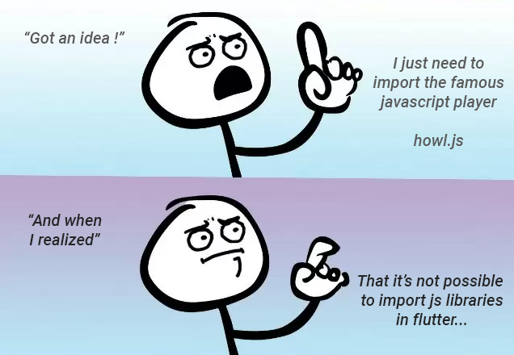
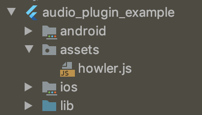

# Import JS Library

Import & use javascript libraries in your flutter web projects.

```dart
flutter:
  assets:
    - assets/howler.js
```

```dart
importJsLibrary(url: "./assets/howler.js", flutterPluginName: "audio_plugin_example");
```

# Why

[]()

Audio library compatible with Flutter Web : https://pub.dev/packages/assets_audio_player

[]()

Howler.js Audio library for the modern web : https://howlerjs.com/

[]()

And after weeks, month, years, eternity later....

[]()

# How to use it

## 1. Create your plugin Package

https://flutter.dev/docs/development/packages-and-plugins/developing-packages

```sh
flutter create --template=package audio_plugin_example
```

## 2. Add the js library in your assets

Downloaded from https://github.com/goldfire/howler.js/tree/master/dist

[]()

## 3. Declare it inside your pubspec.yaml

```dart
flutter:
  assets:
    - assets/howler.js
```

## 4. Import import_js_plugin

```
dependencies:
  import_js_library: ^1.0.0
```

## 5. In your Flutter plugin project, import your .js lib

For example, on the registerWith()

pluginName: the name of your plugin, based on pubspecs.yaml, here `audio_plugin_example`

Using the method `importJsLibrary(url: `PATH_OF_JS`, flutterPluginName: `NAME_OF_FLUTTER_PLUGIN`);`

```dart
class AudioPlugin {

  static void registerWith(Registrar registrar) {
    final MethodChannel channel = MethodChannel(
      'audio_plugin',
      const StandardMethodCodec(),
      registrar.messenger,
    );

    importJsLibrary(url: "./assets/howler.js", flutterPluginName: "audio_plugin_example");
    
    final AudioPlugin instance = AudioPlugin();
    channel.setMethodCallHandler(instance.handleMethodCall);
  }
   
  ...
```

## 6. Using [package:js](https://pub.dev/packages/js), wrap your js methods/classes

```dart
@JS()
library howl.js;

import 'package:js/js.dart';

@JS("Howl")
class Howl {
  external Howl({List<String> src}); 

  external play();
}
```

## 7. Use your library !

```dart
final audio = Howl(src: ["./assets/astronomia.mp3"]);
audio.play();
```

for example in the plugin

```dart

  Howl audio;

  Future<dynamic> handleMethodCall(MethodCall call) async {
    print(call.method);
    switch (call.method) {
      case "play":
        if(audio != null){
          audio.play();
        }
        break;
      case "pause":
        if(audio != null){
          audio.pause();
        }
        break;
      case "open":
        final String path = call.arguments["path"];
        audio = Howl(src: [path]);
        break;
    }
  }
```


